# 🧠 Exploratory Data Analysis (EDA): Student Depression Dataset  
**Generated from:** `eda_basic.py`  
**Plots located in:** `../outputs/eda_plots/`

---

# 1. 📊 Dataset Overview

The cleaned dataset contains the following:

- **Rows:** 27,836  
- **Columns:** 13  
- **Numeric features:**  
  - Age  
  - Academic_Pressure  
  - CGPA  
  - Study_Satisfaction  
  - Work_Study_Hours  

- **Categorical features:**  
  - Gender  
  - Sleep_Duration  
  - Dietary_Habits  
  - Have_you_ever_had_suicidal_thoughts_  
  - Financial_Stress  
  - Family_History_of_Mental_Illness  
  - Degree_Category  

- **Target column:** `Depression`  
- **Missing values:** None  
- **Duplicate rows:** 0 (as reported by `check_duplicates()`)

---

# 2. 🎯 Target Variable — Depression

### Distribution Table
| Depression | Count | Percentage |
|-----------|-------|------------|
| 1 | 16,298 | 58.55% |
| 0 | 11,538 | 41.45% |

### Target Distribution Plot  
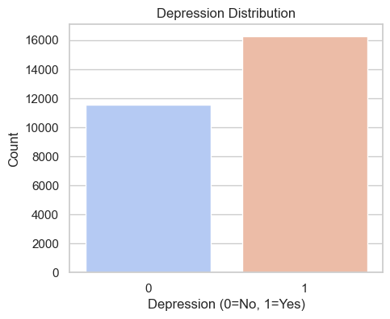

### Interpretation
- The dataset is **imbalanced**, with more depressed students than non-depressed.
- This should be accounted for when training models (consider class weights, oversampling, or alternative metrics).

---

# 3. 🔢 Numeric Feature Analysis

Below are all numeric plots generated by `plot_numeric()`.

---

## 📈 Age  
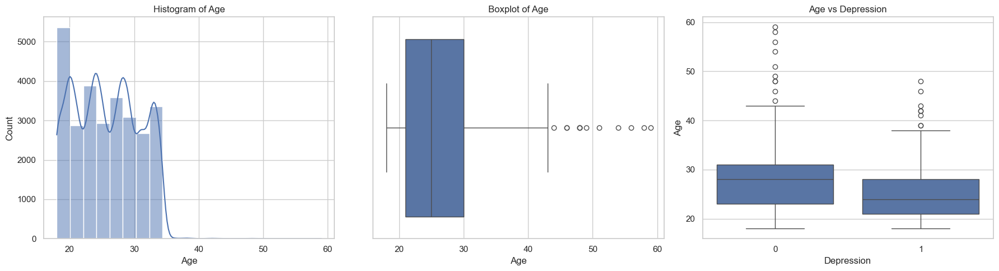

---

## 📈 Academic Pressure  
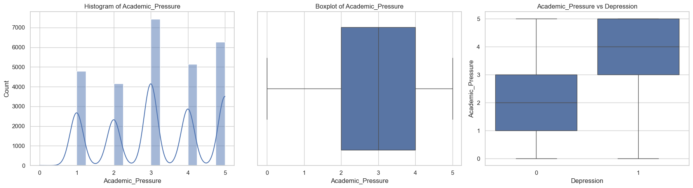

---

## 📈 CGPA  
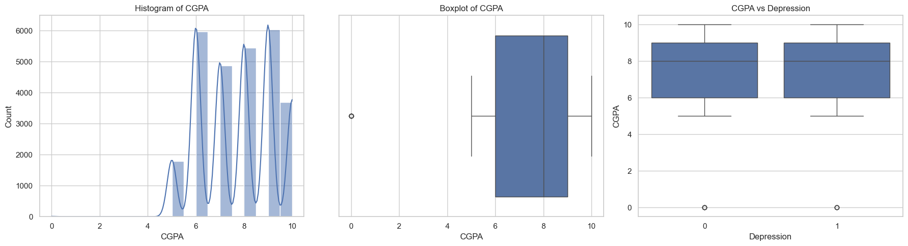

---

## 📈 Study Satisfaction  
(Note: Your file is singular, not plural — referencing exact filename.)  

---

## 📈 Work/Study Hours  
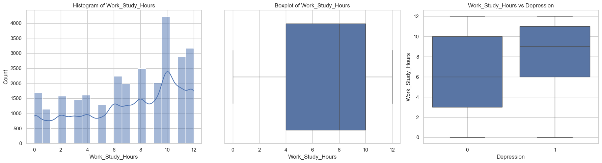

---

### 📌 Observations
- **Age** shows a typical college distribution (mostly 18–30).  
- **Academic Pressure** is generally high (mean ≈ 3.14).  
- **CGPA** is centered around ~7.7, suggesting moderate-to-high academic performance.  
- **Study Satisfaction** varies significantly, indicating differing academic experiences.  
- **Work/Study Hours** show wide variability — potential stress factor.  
- Boxplot comparisons vs Depression indicate:  
  - Higher academic pressure correlates with higher depression.  
  - Lower study satisfaction correlates with higher depression.

---

# 4. 🧩 Categorical Feature Analysis

Below are all category-vs-target plots generated by `plot_categorical_vs_target()`.

---

## 👤 Gender  
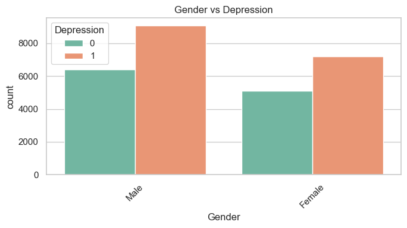

---

## 😴 Sleep Duration  
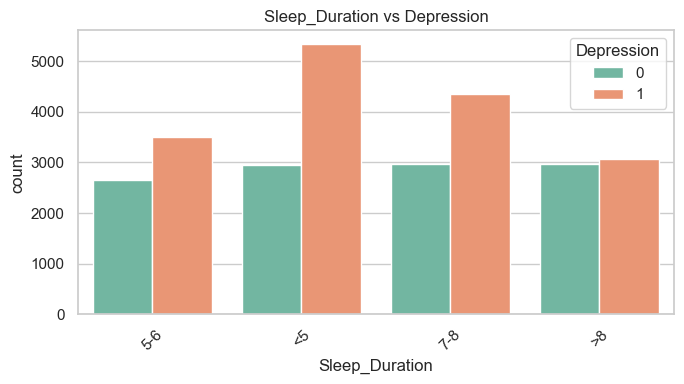

---

## 🍽 Dietary Habits  
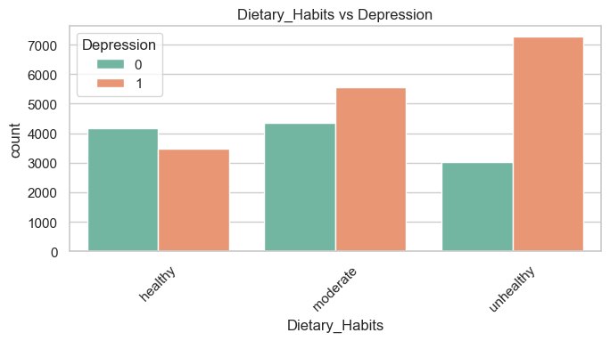

---

## ⚠ Suicidal Thoughts  

---

## 💰 Financial Stress  
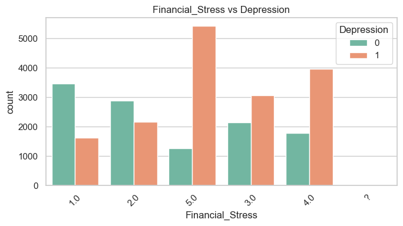

---

## 🧬 Family History of Mental Illness  
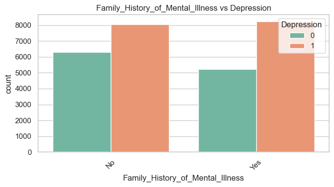

---

## 🎓 Degree Category  
(You had **two versions** but your actual file is this one:)  
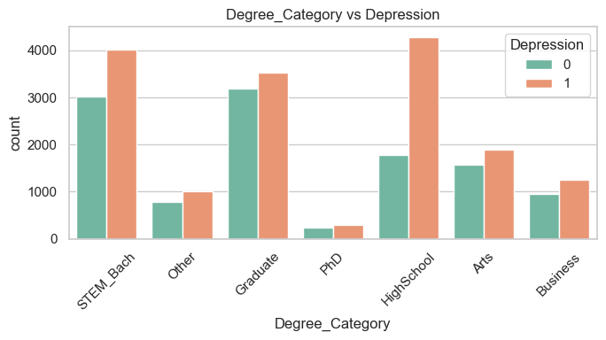

---

### 📌 Observations
- Students with **yes** for suicidal thoughts show significantly higher depression.  
- Higher **financial stress** correlates strongly with depression.  
- Students with **family history of mental illness** show a slightly higher depression rate.  
- **Sleep duration** below 5 hours strongly aligns with depression.  
- Certain degree categories (STEM_Bach, Graduate) appear more associated with depression.

---

# 5. 🔥 Correlation Heatmap

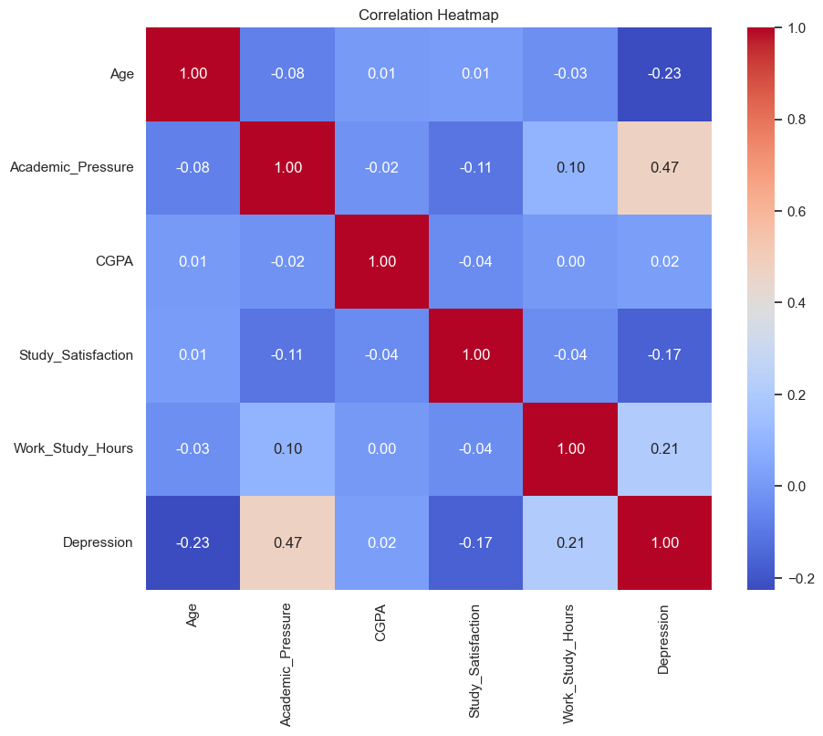

### Key Correlation Notes
- **Academic Pressure**, **Work Study Hours**, and **Financial Stress** show meaningful correlation with Depression.  
- **CGPA** has a negative correlation with Academic Pressure.  
- Most correlations are moderate or weak, which is typical in human-behavior datasets.

---

# 6. 📝 Summary of Insights

### ✔ Data Quality
- No missing values  
- No duplicates  
- Cleaned and well-structured dataset  

### ✔ Major Depression Indicators
- High academic pressure  
- High financial stress  
- Suicidal thoughts reported  
- Lower study satisfaction  
- Short sleep duration (< 5 hours)

### ✔ Modeling Considerations
- Handle class imbalance (58.5% vs 41.5%)  
- Consider normalization for numeric variables  
- Categorical variables need encoding  
- Possible feature engineering:  
  - Sleep × Academic Pressure  
  - Study Satisfaction × CGPA  
  - Work Hours × Financial Stress  

---

# 7. 🚀 Next Steps (Recommended)

- Train baseline logistic regression and decision tree  
- Apply SMOTE or class weights  
- Evaluate using F1-score, ROC-AUC  
- Perform feature importance analysis (Random Forest, XGBoost)  
- Explore SHAP values for interpretability  

---

# ✅ End of EDA Analysis
